# DIGON — Browser Multiplayer RPG

> A real-time multiplayer RPG built with **Phaser 4**, **TypeScript**, **Firebase**, and **Python-scripted AI** — featuring a 1 000 × 1 000-tile procedurally generated world, persistent chunk storage, crafting, dungeons, and a full equipment system. All running in the browser at 60 fps.

---

## Table of Contents

1. [Tech Stack](#tech-stack)
2. [Getting Started](#getting-started)
3. [Architecture Overview](#architecture-overview)
4. [Scenes](#scenes)
5. [World Generation](#world-generation)
6. [Zones](#zones)
7. [Player Champions](#player-champions)
8. [NPC Cast](#npc-cast)
9. [Enemies by Zone](#enemies-by-zone)
10. [Items & Equipment](#items--equipment)
    - [Materials & Consumables](#materials--consumables)
    - [Tools](#tools)
    - [Weapons](#weapons)
    - [Armor Sets](#armor-sets)
11. [Game Systems](#game-systems)
    - [Movement & Collision](#movement--collision)
    - [Combat](#combat)
    - [Inventory](#inventory)
    - [Crafting](#crafting)
    - [Shop](#shop)
    - [Storage (Personal Chest)](#storage-personal-chest)
    - [Experience & Progression](#experience--progression)
12. [Multiplayer & Sync](#multiplayer--sync)
13. [Entity AI](#entity-ai)
14. [Interior Rooms](#interior-rooms)
15. [Sprite Asset Catalog](#sprite-asset-catalog)
16. [Controls](#controls)
17. [Firebase Data Model](#firebase-data-model)
18. [Project Structure](#project-structure)

---

## Tech Stack

| Layer | Technology | Version |
|---|---|---|
| Game Engine | [Phaser](https://phaser.io/) | 4.1.0 |
| Language | TypeScript | 6.0.2 |
| Build Tool | Vite | 8.0.12 |
| Backend / DB | Firebase Realtime Database | 12.13.0 |
| Terrain noise | simplex-noise | 4.0.3 |
| Entity scripting | Pyodide (WASM Python) | 0.26.4 (CDN) |
| Display | 640 × 360 px, pixel-art mode | — |
| Tile size | 16 × 16 px | — |

---

## Getting Started

```bash
# 1. Install dependencies
npm install

# 2. Create .env with your Firebase project credentials
cp .env.example .env
# fill in VITE_FIREBASE_API_KEY, VITE_FIREBASE_DATABASE_URL, etc.

# 3. Deploy Firebase database rules
firebase deploy --only database

# 4. Start dev server  →  http://localhost:5173
npm run dev

# 5. Production build
npm run build
```

---

## Architecture Overview

```
index.html
  └─ main.ts          ← Phaser bootstrap, 640×360, all 12 scenes registered
       ├─ firebase.ts  ← Firebase Realtime Database init
       ├─ Auth.ts      ← SHA-256 login/register, spawn generation, house creation
       └─ Scenes (12)
            ├─ IntroScene
            ├─ InstructionsScene
            ├─ LoginScene
            ├─ LoadingScene  ← WorldBootstrap, chunk pre-load, progress bar
            ├─ GameScene     ← Main game loop
            ├─ HudScene      ← Persistent overlay (HP/MP/gold/chat/D-pad)
            ├─ DialogScene
            ├─ InventoryScene
            ├─ CraftScene
            ├─ ShopScene
            ├─ StorageScene
            └─ DeathScene
```

Game-loop entities live in `GameScene` and are driven by `PlayerController`, `TilemapRenderer`, `SpriteAnim`, and `ScriptExecutor`. Firebase listeners keep remote players, enemies, and NPCs in sync at ≤100 ms latency.

---

## Scenes

### IntroScene
Title screen displaying **"DIGON"** over a darkened screenshot backdrop. Two buttons: **Play** (→ LoginScene) and **How to Play** (→ InstructionsScene). Also exposes a fullscreen toggle.

### InstructionsScene
Full-screen how-to-play overlay. Lists all keyboard controls, explains zone types, combat, crafting tiers, and proximity chat. Returns to IntroScene on close.

### LoginScene
Two-panel card: **Login** (name + password) and **Register** (name + password + champion select). Renders 8 champion portrait tiles on a canvas element directly from the spritesheet (frame 0, scaled 2×). SHA-256 hashes the password client-side before any Firebase write.

### LoadingScene
Runs on first entry only:
1. Preloads all spritesheets and tile images via `this.load.*`
2. Runs `WorldBootstrap` — generates `/config/seed`, `/config/pois` (100 villages + 100 dungeon entrances) if not already present
3. Pre-generates the 9 chunks around the player's spawn position
4. Shows an animated progress bar

### GameScene
The main game loop. Key responsibilities:

| Subsystem | Description |
|---|---|
| `TilemapRenderer` | Pooled `Phaser.Image` objects at 3 depth layers (ground=0, mid=1, top=20); player at depth 10 |
| `PlayerController` | Arrow-key input, per-axis collision, tile-speed modifiers, attack/interact (A key) |
| `ChunkManager` | `ensureRadius()` called each frame; lazy-generates + caches 32×32-tile chunks via Firebase |
| Remote players | Firebase presence listener; tweens to new positions every 100 ms |
| Remote enemies/NPCs | Python-driven via `ScriptExecutor`; each client claims a slice of entities |
| Room transitions | Walking onto building/dungeon tile auto-enters interior room; exit tile returns to overworld |
| Camera | Follows player (lerp=1), bounds to world, zoom via scroll wheel |

### HudScene
Always-on overlay scene that runs in parallel with GameScene:

- HP / MP / Gold / Level bars updated via Firebase listener
- Proximity chat: press **Enter** to focus input; messages broadcast to `/chat/{room}`; auto-prune >5 min old
- Mobile D-pad: rendered when viewport < 640 px wide
- Fullscreen button (top-right corner)
- Inventory button (I icon, top-left)

### DialogScene
Triggered when the player presses **A** adjacent to an NPC. Modal overlay with NPC portrait and dialogue lines. NPC roles:

| Role | Behaviour |
|---|---|
| `heal` | Restores HP/MP for gold |
| `merchant` | Opens ShopScene |
| `gossip` | Random lore/hint lines |
| `guard` | Warns the player |
| `chat` | Generic villager conversation |
| `dog` | Follows the player after interaction |

### InventoryScene
Opened with **I**. Two sections:

- **Equipment panel** — weapon slot + 5 armour slots (helmet, chestplate, leggings, boots, gloves); shows combined ATK/DEF totals
- **Backpack grid** — stackable items; click item to use (consumables) or equip (gear); click equipped slot to unequip

### CraftScene
Opened automatically when the player presses **A** adjacent to a crafting station tile (workbench, workshop, dungeon altar). **C** or **Esc** closes the overlay. Filters the 23 recipes by:
1. Station type (`workbench` / `workshop` / `dungeon_altar`)
2. Player level gate

Shows ingredient requirements with green/red colour coding. Successful craft consumes ingredients and sends item to inventory.

### ShopScene
Opened via merchant NPC dialogue. Two tabs:

- **Buy** — zone-adjusted prices with ±15 % per-village seed jitter; limited daily stock tracked in Firebase per village
- **Sell** — sell any inventory item for fallback price

### StorageScene
Opened by clicking the personal storage chest inside the player's house. Drag or click items between the **inventory grid** and the **chest grid**. Chest contents are stored in Firebase at `/players/{id}/chest`.

### DeathScene
Full-screen overlay on player death:
- Shows killer name, gold retained, items lost list
- 10-second auto-respawn countdown with manual **Respawn** button
- On respawn: player teleported to personal house, HP restored to 50 %

---

## World Generation

| Property | Value |
|---|---|
| World size | 1 000 × 1 000 tiles |
| Chunk size | 32 × 32 tiles |
| Chunk grid | 32 × 32 chunks (1 024 total) |
| Sector grid | 10 × 10 sectors (100 × 100 tiles each) |
| POIs | 1 village + 1 dungeon entrance per sector (100 each) |
| World seed | Generated once on first login, stored at `/config/seed` |

### Generation Pipeline

```
WorldBootstrap (LoadingScene)
  ├─ Generate world seed
  ├─ Compute 100 village + 100 dungeon POI coordinates
  ├─ Pre-stamp road network (dirt_path tiles between POIs)
  └─ Pre-generate 9 spawn-area chunks

ChunkManager.ensureRadius() (GameScene, per-frame)
  └─ For each unseen chunk:
       ├─ Read from Firebase /map/{cx}_{cy}  (if cached)
       └─ generateChunk(cx, cy, seed, pois)   (if new)
            ├─ Elevation + moisture noise → zone assignment
            ├─ Zone-specific tile scatter (trees, rocks, etc.)
            ├─ Village stamp (if POI in chunk)
            └─ Dungeon entrance stamp (if POI in chunk)
```

All generation is **purely deterministic** from the seed, so any client produces identical tile data without coordination.

---

## Zones

### Plains
    

> Elevation 0.25–0.55 · Moisture 0–0.65

Open grassland. Passable ground with occasional rocks, flowers, and dirt paths. The safest starting zone — wolves and bandits are the main threat.

Scatter props:   

---

### Forest
     

> Elevation 0.3–0.7 · Moisture 0.65–1.0

Dense woodland. Trees and bushes are **impassable**; paths wind between them. Conceals giant spiders, goblins, and treants. Mushrooms and logs are gatherable resources.

---

### River
   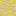 

> Elevation 0–0.25 · Moisture 0.6–1.0

Water bodies split the world. **Shallow water** (10 % speed), **deep water** (20 % speed), **mud** (50 % speed). River trolls and water spirits patrol the banks and shallows.

---

### Desert
      

> Elevation 0.55–1.0 · Moisture 0–0.35

Arid wasteland. Quicksand slows to 70 % speed. Oases provide safe ground. Scorpions, mummies, and sand worms threaten travellers.

---

### Village
   

One per 100 × 100-tile sector. Generated around a 5 × 5 cobblestone central square with four cobblestone arms. Each village contains:

| Building | Sprite |
|---|---|
| Hut (small house) |  |
| House (large) |  |
| Tavern |  |
| Barracks |  |
| Chapel |  |
| Workshop |  |
| Market stall |  |
| Well |  |
| Quest board |  |
| Street sign |  |
| Tombstone |  |

---

### Dungeon Entrance


One per sector. Walking onto the entrance tile transitions the player into a procedurally generated multi-floor BSP dungeon room (ID: `dungeon_{tx}_{ty}_floor_{n}`).

---

## Player Champions

All player spritesheets are **80 × 128 px** (5 columns × 8 rows, each frame 16 × 16 px). Rows 0–3 = walk cycle (down/up/right/left × 5 frames). Rows 4–7 = attack animation (same directions).

| Champion | Sprite | Description |
|---|---|---|
| Arthax | 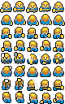 | Armoured knight |
| Börg | 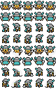 | Heavy warrior |
| Gangblanc | 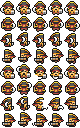 | Rogue archer |
| Grum | 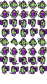 | Barbarian brawler |
| Kanji | 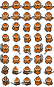 | Eastern mystic |
| Katan | 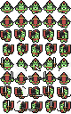 | Samurai swordsman |
| Okomo | 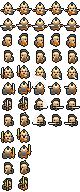 | Spirit shaman |
| Zhinja | 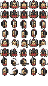 | Shadow ninja |

Champion selection happens at account creation and is permanent. All champions share identical base stats — the choice is purely cosmetic.

---

## NPC Cast

| NPC | Sprite | Role |
|---|---|---|
| Guard |  | Patrols village perimeter; warns players about danger |
| Healer |  | Restores HP/MP for gold |
| Merchant | 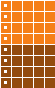 | Opens zone-priced shop |
| Fisherman | 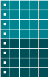 | Gossip / lore dialogue |
| Gossiper |  | Shares world rumours |
| Hunter | 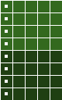 | Hunting tips |
| Wanderer | 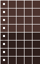 | Random patrol, neutral chat |
| Dog | 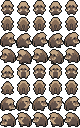 | Follows player after interaction; remembers follower ID in AI memory |

NPCs move via Python AI scripts (`wander.py`, `dog_follow.py`) run in the Pyodide sandbox. Press **A** when adjacent to start dialogue.

---

## Enemies by Zone

Enemies use the same 16 × 16-frame spritesheet layout as players. They are authored in `enemies.ts` with full stat blocks, loot tables, and AI behaviour templates.

### Plains & Village

| Enemy | Sprite | HP | Power | Trait |
|---|---|---|---|---|
| Rat (weak) | 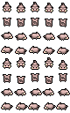 | 12 | 2 | `patrol_only` |
| Wolf |  | 22–35 | 4–6 | `patrol_chase` |
| Bandit (weak) | 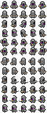 | 20 | 4 | `patrol_chase` |
| Bandit (strong) | 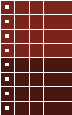 | 35 | 7 | `patrol_aggressive` — steals gold on hit |
| Thief | 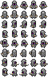 | 28 | 5 | `patrol_flee` — coward, retreats then ambushes |

### Forest

| Enemy | Sprite | HP | Power | Trait |
|---|---|---|---|---|
| Giant Spider | 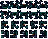 | 18–30 | 4–7 | `patrol_chase` — poisons target |
| Goblin Scout | 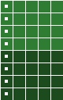 | 16 | 3 | `patrol_pack` — passive until struck, then full-group retaliation |
| Treant | 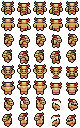 | 60 | 8 | `patrol_persistent` — slow, never fully de-aggros |

### River

| Enemy | Sprite | HP | Power | Trait |
|---|---|---|---|---|
| Crab | 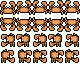 | 14–20 | 3–5 | `patrol_only` — territorial |
| River Troll | 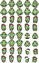 | 40–55 | 6–9 | `patrol_aggressive` |
| Water Spirit |  | 25–45 | 5–8 | `patrol_chase` — enraged form at low HP |

### Desert

| Enemy | Sprite | HP | Power | Trait |
|---|---|---|---|---|
| Scorpion | 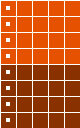 | 20–38 | 4–8 | `patrol_chase` — poisons target |
| Sand Worm | 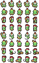 | 50 | 7 | `patrol_aggressive` |
| Mummy | 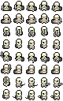 | 30 | 6 | `patrol_persistent` |
| Desert Bandit |  | 32 | 6 | `patrol_aggressive` |

### Dungeon — Floor 1

| Enemy | Sprite | HP | Power | Trait |
|---|---|---|---|---|
| Skeleton |  | 20–35 | 4–6 | `patrol_persistent` |
| Slime (weak) | 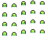 | 14 | 2 | `patrol_only` |
| Slime (corrosive) | 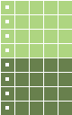 | 20 | 4 | `patrol_chase` — reduces armour |
| Zombie |  | 25–40 | 5–7 | `patrol_persistent` |

### Dungeon — Floor 2+

| Enemy | Sprite | HP | Power | Trait |
|---|---|---|---|---|
| Dark Knight (weak) | 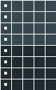 | 50 | 8 | `patrol_aggressive` |
| Dark Knight (elite) | 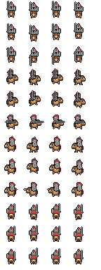 | 70 | 10 | `patrol_aggressive` |
| Ghost |  | 30–50 | 6–9 | `patrol_persistent` — enraged form |
| Dark Mage (weak) | 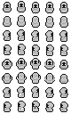 | 35 | 7 | `patrol_chase` |
| Dark Mage (strong) |  | 55 | 10 | `patrol_aggressive` |
| Necromancer |  | 65 | 9 | `patrol_aggressive` — summons undead |
| Dungeon Boss | 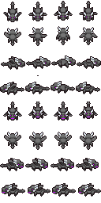 | 80+ | 12+ | `patrol_aggressive` — elite floor guardian |

---

## Items & Equipment

### Materials & Consumables

| Item | Sprite | Type | Effect / Use |
|---|---|---|---|
| Wood |  | Material | Crafting ingredient |
| Stone |  | Material | Crafting ingredient |
| Iron Ore |  | Material | Smelted into iron bar |
| Iron Bar |  | Material | Iron-tier crafting |
| Leather |  | Material | Leather-tier crafting |
| Mushroom |  | Material | Cook into cooked mushroom |
| Gold Coin |  | Currency | Shop purchases, healer fees |
| Health Potion |  | Consumable | +40 % max HP |
| Mana Potion |  | Consumable | +40 % max MP |
| Antidote |  | Consumable | +10 HP, cures poison |
| Cooked Mushroom |  | Consumable | +20 HP |
| Dungeon Key |  | Key | Opens locked dungeon chests |

---

### Tools

| Tool | Sprite | Crafted At |
|---|---|---|
| Axe |  | Workbench |
| Pickaxe |  | Workbench |
| Scythe |  | Workbench |

---

### Weapons

| Weapon | Sprite | Power | Special | Crafted At |
|---|---|---|---|---|
| Wooden Sword |  | 4 | — | Workbench |
| Wooden Bow |  | 5 | — | Workbench |
| Oak Staff |  | 8 | 5 MP/swing | Workbench |
| Iron Sword |  | 10 | — | Workshop |
| Iron Bow |  | 11 | — | Workshop |
| Iron Axe |  | 12 | — | Workshop |
| Iron Staff |  | 16 | 8 MP/swing, AoE | Workshop |
| Shadow Blade |  | 22 | Lifesteal | Dungeon Altar |

---

### Armor Sets

Three tiers, five slots each (helmet, chestplate, leggings, boots, gloves):

#### Leather (Tier 1 — Level 1+) · Workbench

| Piece | Sprite | Defense |
|---|---|---|
| Helmet |  | 2 |
| Chestplate |  | 4 |
| Leggings |  | 3 |
| Boots |  | 2 |
| Gloves |  | 2 |

#### Iron (Tier 2 — Level 4+) · Workshop

| Piece | Sprite | Defense | Penalty |
|---|---|---|---|
| Helmet |  | 5 | — |
| Chestplate |  | 9 | −5 % AGI |
| Leggings |  | 7 | −5 % AGI |
| Boots |  | 3 | — |
| Gloves |  | 4 | −10 % AGI |

#### Shadow (Tier 3 — Level 8+) · Dungeon Altar

| Piece | Sprite | Defense | Special |
|---|---|---|---|
| Helmet |  | 8 | +speed |
| Chestplate |  | 14 | Lifesteal |
| Leggings |  | 11 | Lifesteal |
| Boots | 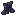 | 5 | +speed |
| Gloves |  | 6 | +power |

---

## Game Systems

### Movement & Collision

Movement is Arrow-key driven at **80 px/s** base speed. Collision is checked per-axis, allowing smooth sliding along walls. Tile-based speed multipliers:

| Tile | Multiplier | Sprite |
|---|---|---|
| Dirt Path | ×1.1 (faster) |  |
| Grass Tall | ×0.6 |  |
| Mud | ×0.5 |  |
| Reeds | ×0.7 |  |
| Sand Dune | ×0.7 |  |
| Quicksand | ×0.7 |  |
| Water Shallow | ×0.1 |  |
| Water Deep | ×0.2 |  |

**Impassable tiles**: rocks, trees, bushes, dungeon/house walls, and the void border.

---

### Combat

1. Press **A** to attack; hits all enemies within melee range.
2. **Damage formula**: `max(1, player_power + weapon_power − enemy_defense)`
3. Enemy HP synced to Firebase on each hit; local cache prevents mid-fight snapshot overwrites.
4. **Invincibility window**: 600 ms after taking damage (prevents rapid-fire multi-hit stacking).
5. **Special effects**:
   - *Lifesteal* (shadow gear): % of damage dealt returns as HP
   - *Area damage* (iron staff): hits all enemies in radius
   - *Poison* (spiders, scorpions): tick damage over time
   - *Gold steal* (strong bandits): gold removed from player on hit
6. Enemy death drops loot (items + gold) as a Firebase loot bundle.
7. Player death triggers `DeathScene`; items dropped, gold retained, respawn at house.

---

### Inventory

```
Equipment slots (7)          Backpack grid (N×M)
┌────────────────────┐       ┌──────────────────────┐
│ [Weapon]           │       │ [Item] [Item] [Item]  │
│ [Helmet]           │       │ [Item] [Item] ...     │
│ [Chestplate]       │       └──────────────────────┘
│ [Leggings]         │
│ [Boots]            │       ATK total: 22
│ [Gloves]           │       DEF total: 41
└────────────────────┘
```

- Click a backpack item to **equip** (gear) or **use** (consumables)
- Click an equipped slot to **unequip** back to backpack
- Items stack up to their defined max stack count

---

### Crafting

**23 recipes** across 3 stations:

#### Workbench (inside every house)


| Recipe | Output | Level | Ingredients |
|---|---|---|---|
| Axe | axe | 1 | 3 wood + 1 stone |
| Pickaxe | pickaxe | 1 | 3 wood + 2 stone |
| Scythe | scythe | 1 | 2 wood + 1 stone |
| Wooden Sword | wooden_sword | 1 | 4 wood |
| Wooden Bow | wooden_bow | 1 | 4 wood + 2 leather |
| Oak Staff | oak_staff | 2 | 5 wood + 1 mushroom |
| Leather Helmet | leather_helmet | 1 | 3 leather |
| Leather Chestplate | leather_chestplate | 1 | 6 leather |
| Leather Leggings | leather_leggings | 1 | 5 leather |
| Leather Boots | leather_boots | 1 | 3 leather |
| Leather Gloves | leather_gloves | 1 | 2 leather |
| Health Potion | health_potion | 1 | 2 mushroom |
| Cooked Mushroom | cooked_mushroom | 1 | 1 mushroom |

#### Workshop (in village)


| Recipe | Output | Level | Ingredients |
|---|---|---|---|
| Iron Bar | iron_bar | 2 | 2 iron_ore |
| Iron Sword | iron_sword | 4 | 3 iron_bar + 2 wood |
| Iron Axe | iron_axe | 4 | 4 iron_bar + 1 wood |
| Iron Bow | iron_bow | 4 | 2 iron_bar + 3 wood + 2 leather |
| Iron Staff | iron_staff | 6 | 4 iron_bar + 3 wood |
| Iron Helmet | iron_helmet | 4 | 4 iron_bar |
| Iron Chestplate | iron_chestplate | 4 | 8 iron_bar |
| Iron Leggings | iron_leggings | 4 | 6 iron_bar |
| Iron Boots | iron_boots | 4 | 4 iron_bar |
| Iron Gloves | iron_gloves | 4 | 3 iron_bar |

#### Dungeon Altar (inside dungeons)


| Recipe | Output | Level | Ingredients |
|---|---|---|---|
| Shadow Blade | shadow_blade | 10 | 8 iron_bar + 3 dungeon_key |
| Shadow Helmet | shadow_helmet | 8 | 6 iron_bar + 2 dungeon_key |
| Shadow Chestplate | shadow_chestplate | 8 | 10 iron_bar + 4 dungeon_key |
| Shadow Leggings | shadow_leggings | 8 | 8 iron_bar + 3 dungeon_key |
| Shadow Boots | shadow_boots | 8 | 5 iron_bar + 2 dungeon_key |
| Shadow Gloves | shadow_gloves | 8 | 4 iron_bar + 2 dungeon_key |

---

### Shop

Each merchant NPC opens ShopScene with **zone-based pricing**:

| Zone | Wood | Leather | Iron Ore | Stone |
|---|---|---|---|---|
| Forest | ×0.7 | ×0.7 | ×1.4 | — |
| River | — | ×0.7 | ×1.4 | ×1.4 |
| Desert | ×1.4 | — | — | — |

Additionally every village applies a **±15 % seeded jitter** (`worldSeed XOR village_position`). Stock is limited and restocks every **24 real hours**, tracked per village in Firebase.

---

### Storage (Personal Chest)

Every player gets a personal house on registration. Inside:

```
House Interior (8×8 tiles)
┌─────────────────────────────────┐
│ [wall][wall][door][wall][wall]  │
│ [wall]  ....room....   [wall]  │
│ [chest]        [workbench]      │
│ [wall]     [bed][sofa]  [wall]  │
│ [wall][wall][wall][wall][wall]  │
└─────────────────────────────────┘
```

 Personal storage chest — contents at `/players/{id}/chest`, independent of inventory.

 Workbench — opens CraftScene (Workbench tier recipes only).

---

### Experience & Progression

- **Levels 1–20**
- **Stats**: Strength, Agility, Intelligence, Endurance (base 5, scale per level)
- **Power (ATK)** = base_power + weapon_power × strength_modifier
- **Defense** = sum of equipped armor defense values, adjusted by agility penalty for heavy iron gear
- XP gained from each enemy kill; level-up broadcast as system message in proximity chat

---

## Multiplayer & Sync

| Data | Firebase Path | Update Rate |
|---|---|---|
| Player position | `/players/{id}/x`, `y`, `direction` | Every 100 ms |
| Player stats | `/players/{id}` | On change |
| Presence (room) | `/presence/{room}/players/{id}` | On join/leave |
| Enemy state | `/presence/{room}/enemies/{id}` | On AI tick |
| NPC state | `/presence/{room}/npcs/{id}` | On AI tick |
| Proximity chat | `/chat/{room}` | On message send; pruned >5 min |
| World chunks | `/map/{cx}_{cy}` | Once on first visit (cached forever) |
| POI config | `/config/pois` | Once on world init |
| Shop stock | `/shops/{village_id}` | On purchase; restocks every 24h |

Remote player sprites are **tweened** to new positions on each Firebase snapshot, producing smooth motion at 10 snapshots/sec.

---

## Entity AI

Enemies and NPCs are scripted in **Python**, executed via **Pyodide (WASM)** loaded asynchronously from CDN. The `ScriptExecutor` runs on a **6 ms per-frame time budget** and distributes entities across clients by claiming them with a 10-second staleness TTL.

### Sandbox API exposed to scripts

```python
state          # current AI state string
hp, max_hp     # current/max health
x, y           # world position (tiles)
memory         # dict persisted per-entity in Firebase
nearby_players # list of {id, x, y, distance}

move(dx, dy)              # move one step
attack(target_id)         # attack entity
set_state(new_state)      # transition AI state
speak(message)            # emit chat bubble
set_memory(key, value)    # persist value to Firebase
```

### Behaviour Templates

| Template | Description |
|---|---|
| `patrol_only` | Territorial — attacks only if player enters adjacent tile |
| `patrol_chase` | Standard — patrols → aggros within range → chases → attacks |
| `patrol_flee` | Coward — retreats, only attacks when cornered |
| `patrol_pack` | Passive until any pack member is hit, then entire group retaliates |
| `patrol_aggressive` | Relentless — wide aggro, tracks last known position, slow de-aggro |
| `patrol_persistent` | Slow notice, never fully de-aggros (undead / treant) |

---

## Interior Rooms

### House Interior
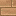    

Room ID: `house_{tx}_{ty}` (derived from building tile position — fully deterministic).  
Size: **8 × 8 tiles**. Contains border walls, house floor, seeded-random furniture, workbench, storage chest, and exit door. Some houses have a **cellar staircase**.

### Cellar
    

Room ID: `cellar_{tx}_{ty}_floor_1`.  
Small underground room — extra chest and traps. Exit via stairs up.

### Dungeon (BSP Multi-floor)
        

Room ID: `dungeon_{tx}_{ty}_floor_{n}`.  
Size: **40 × 40 tiles** per floor. BSP-split into connected rooms with corridors. Each floor features:
- Floor tiles, walls, and decorative pillars
- Traps (damage tiles)
- Locked chests (require dungeon key)
- Dungeon altar (shadow-tier crafting)
- Stairs up / stairs down between floors
- Tombstones (lore/decoration)
- Progressively harder enemy spawns on deeper floors

---

## Sprite Asset Catalog

Complete listing of all 145+ sprites in `public/assets/sprites/`:

```
sprites/
├── Armors/
│   ├── iron_boots.png          iron_chestplate.png     iron_gloves.png
│   ├── iron_helmet.png         iron_leggings.png
│   ├── leather_boots.png       leather_chestplate.png  leather_gloves.png
│   ├── leather_helmet.png      leather_leggings.png
│   └── shadow_boots.png        shadow_chestplate.png   shadow_gloves.png
│       shadow_helmet.png       shadow_leggings.png
├── Cellars/
│   ├── CellarChest.png  CellarFloor.png  CellarStairsUp.png
│   ├── CellarTrap.png   CellarWall.png
├── Dungeon/
│   ├── Chest.png         DungeonAltar.png    DungeonFloor.png
│   ├── DungeonPillar.png DungeonTrap.png     DungeonWall.png
│   ├── StairDown.png     StairUp.png         Tombstone.png
├── Enemies/   (26 enemy sprites — see Enemies section)
├── House/
│   ├── Bed.png  Chest.png  Door.png  HouseFloor.png
│   ├── Sofa.png  Table.png  WorkBench.png
├── Items/     (12 item sprites — see Items section)
├── NPCs/      (8 NPC sprites — see NPC section)
├── Player/    (8 champion sprites)
├── Tools/     axe.png  pickaxe.png  scythe.png
├── Weapons/   (8 weapon sprites — see Weapons section)
└── World/
    ├── Buildings/   (12 building sprites)
    ├── Ground/      (15 terrain sprites)
    └── Nature/      (15 nature props)
```

---

## Controls

| Key / Input | Action |
|---|---|
| **Arrow keys** | Move |
| **A** | Attack enemy / interact with NPC / open crafting station / open chest |
| **I** | Open / close Inventory |
| **C** / **Esc** | Close Crafting overlay |
| **Esc** | Close any active overlay / unfocus chat |
| **Enter** | Focus proximity chat input / send message |
| **Scroll wheel** | Zoom camera in/out |
| **Tap adjacent tile** (touch) | Interact (equivalent to A key) |
| **Pinch** (touch) | Zoom camera in/out |
| **Mobile D-pad** | Move + action button (auto-shown on screen < 640 px wide) |
| **Fullscreen button** | Toggle fullscreen (HUD, top-right) |

---

## Firebase Data Model

```
/config
  /seed              ← world seed (number, set once)
  /pois              ← array of {type, tx, ty} for all POIs

/map/{cx}_{cy}       ← flat array of 1024 tile keys (chunk data, immutable after gen)

/players/{id}
  name, sprite, passwordHash
  x, y, room, direction
  hp, mp, gold, xp, level
  stats: { strength, agility, intelligence, endurance }
  inventory: { ... }
  equipment: { weapon, helmet, chestplate, leggings, boots, gloves }
  chest: { ... }

/presence/{room}
  /players/{id}      ← name, level, sprite, x, y, direction, state
  /enemies/{id}      ← entityId, type, x, y, hp, state, direction
  /npcs/{id}         ← entityId, type, x, y, state, direction, memory

/chat/{room}/{msgId} ← sender, message, x, y, timestamp

/shops/{village_id}  ← stock counts + lastRestock timestamp
```

---

## Project Structure

```
rpidigo/
├── index.html
├── package.json
├── tsconfig.json
├── vite.config.ts
├── database.rules.json
├── src/
│   ├── main.ts                  ← Phaser bootstrap
│   ├── firebase.ts              ← Firebase init
│   ├── Auth.ts                  ← Login / register
│   ├── scenes/
│   │   ├── IntroScene.ts
│   │   ├── InstructionsScene.ts
│   │   ├── LoginScene.ts
│   │   ├── LoadingScene.ts
│   │   ├── GameScene.ts
│   │   ├── HudScene.ts
│   │   ├── DialogScene.ts
│   │   ├── InventoryScene.ts
│   │   ├── CraftScene.ts
│   │   ├── ShopScene.ts
│   │   ├── StorageScene.ts
│   │   └── DeathScene.ts
│   ├── world/
│   │   ├── ChunkGen.ts          ← Deterministic tile generation
│   │   ├── VillageGen.ts        ← Village stamp algorithm
│   │   ├── DungeonGen.ts        ← BSP dungeon floors
│   │   ├── CellarGen.ts
│   │   ├── HouseGen.ts
│   │   ├── RoadNetwork.ts       ← Pre-computed dirt-path routes
│   │   ├── bootstrap.ts         ← WorldBootstrap (seed + POIs)
│   │   ├── registries.ts        ← Tile key → sprite mappings
│   │   ├── types.ts
│   │   └── utils.ts             ← Seeded RNG, SHA-256, tile helpers
│   ├── data/
│   │   ├── items.ts
│   │   ├── weapons.ts
│   │   ├── armors.ts
│   │   ├── enemies.ts
│   │   ├── recipes.ts
│   │   ├── zones.ts
│   │   └── shop.ts
│   └── game/
│       ├── PlayerController.ts  ← Input, movement, collision
│       ├── TilemapRenderer.ts   ← Pooled sprite renderer
│       ├── SpriteAnim.ts        ← Walk/attack animation FSM
│       ├── ChunkManager.ts      ← Lazy chunk load/cache
│       ├── ScriptExecutor.ts    ← Pyodide AI runner
│       └── VirtualInput.ts      ← Mobile D-pad
└── public/
    └── assets/
        └── sprites/             ← All 145+ PNG spritesheets
```

---

## License

This project is licensed under the MIT License.

You are free to use, modify, and distribute this project. Please credit the original authors and maintain the same license when distributing modified versions.

### Attribution

Sprites - https://merchant-shade.itch.io/16x16-mini-world-sprites (credit to merchant-shade)
